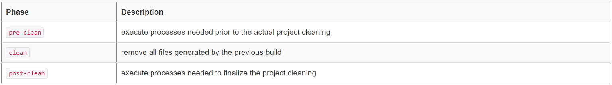

# Maven默认生命周期

MAVEN默认以下三个标准的生命周期，同一个生命周期中的阶段是有先后顺序的，并且后面的阶段依赖于前面的阶段：

生命周期	描述	阶段数量(个)
clean	用于清理项目	3
default	用于构建项目	23
clean	用于建立站点	4
①. CLEAN生命周期中的3个阶段：



②. DEFAULT生命周期中的23个阶段


③. SITE生命周期中的4个阶段


maven插件使用有两种使用法：

1. mvn 生命周期   生命周期使用法（这种是通过配置插件，插件里面配置了插件的glob和phase）
2. mvn 插件名:插件目标   插件使用法

上面两种方法可以混用，如

```bash
# 执行clean生命周期，然后执行 myplugin插件的myglob目标，然后执行DEFAULT生命周期中直到test phase
mvn clean myplugin:myglob test
```


# Maven插件开发

自定义插件的类必须继承 AbstractMojo 并实现他的 execute 方法，而 execute 方法其实就是这个插件的入口类。

示例代码中有两个很重要的注解，一个是 @Mojo ，它主要用来定义插件相关的信息 ，其中 name 属性用来指定这个插件名称，同 clean 类似。

另外一个重要注解 @Parameter ，则是用来指定插件运行时使用的参数，其中 name 是参数名，defaultValue 顾名思义是默认值，也就是在用户没有设置的时候使用的值。


导入依赖

```xml
<project xmlns="http://maven.apache.org/POM/4.0.0" xmlns:xsi="http://www.w3.org/2001/XMLSchema-instance"
  xsi:schemaLocation="http://maven.apache.org/POM/4.0.0 http://maven.apache.org/xsd/maven-4.0.0.xsd">
  <modelVersion>4.0.0</modelVersion>

  <groupId>org.joker</groupId>
  <artifactId>plugin-demo</artifactId>
  <version>1.0.0</version>
  <packaging>maven-plugin</packaging>

  <name>plugin-demo Maven Plugin</name>

  <!-- FIXME change it to the project's website -->
  <url>http://maven.apache.org</url>

  <properties>
    <project.build.sourceEncoding>UTF-8</project.build.sourceEncoding>
  </properties>

  <dependencies>
    <dependency>
      <groupId>org.apache.maven</groupId>
      <artifactId>maven-plugin-api</artifactId>
      <version>2.0</version>
    </dependency>
    <dependency>
      <groupId>org.apache.maven.plugin-tools</groupId>
      <artifactId>maven-plugin-annotations</artifactId>
      <version>3.2</version>
      <scope>provided</scope>
    </dependency>
    <dependency>
      <groupId>org.codehaus.plexus</groupId>
      <artifactId>plexus-utils</artifactId>
      <version>3.0.8</version>
    </dependency>
    <dependency>
      <groupId>junit</groupId>
      <artifactId>junit</artifactId>
      <version>4.8.2</version>
      <scope>test</scope>
    </dependency>
  </dependencies>

  <build>
    <plugins>
      <plugin>
        <groupId>org.apache.maven.plugins</groupId>
        <artifactId>maven-plugin-plugin</artifactId>
        <version>3.2</version>
        <configuration>
          <goalPrefix>plugin-demo</goalPrefix>
          <skipErrorNoDescriptorsFound>true</skipErrorNoDescriptorsFound>
        </configuration>
        <executions>
          <execution>
            <id>mojo-descriptor</id>
            <goals>
              <goal>descriptor</goal>
            </goals>
          </execution>
          <execution>
            <id>help-goal</id>
            <goals>
              <goal>helpmojo</goal>
            </goals>
          </execution>
        </executions>
      </plugin>
    </plugins>
  </build>
  <profiles>
    <profile>
      <id>run-its</id>
      <build>

        <plugins>
          <plugin>
            <groupId>org.apache.maven.plugins</groupId>
            <artifactId>maven-invoker-plugin</artifactId>
            <version>1.7</version>
            <configuration>
              <debug>true</debug>
              <cloneProjectsTo>${project.build.directory}/it</cloneProjectsTo>
              <pomIncludes>
                <pomInclude>*/pom.xml</pomInclude>
              </pomIncludes>
              <postBuildHookScript>verify</postBuildHookScript>
              <localRepositoryPath>${project.build.directory}/local-repo</localRepositoryPath>
              <settingsFile>src/it/settings.xml</settingsFile>
              <goals>
                <goal>clean</goal>
                <goal>test-compile</goal>
              </goals>
            </configuration>
            <executions>
              <execution>
                <id>integration-test</id>
                <goals>
                  <goal>install</goal>
                  <goal>integration-test</goal>
                  <goal>verify</goal>
                </goals>
              </execution>
            </executions>
          </plugin>
        </plugins>

      </build>
    </profile>
  </profiles>
</project>
```


```java
import org.apache.maven.execution.MavenSession;
import org.apache.maven.plugin.AbstractMojo;
import org.apache.maven.plugin.MojoExecution;
import org.apache.maven.plugin.descriptor.PluginDescriptor;
import org.apache.maven.plugins.annotations.Component;
import org.apache.maven.plugins.annotations.Execute;
import org.apache.maven.plugins.annotations.InstantiationStrategy;
import org.apache.maven.plugins.annotations.LifecyclePhase;
import org.apache.maven.plugins.annotations.Mojo;
import org.apache.maven.plugins.annotations.Parameter;
import org.apache.maven.plugins.annotations.ResolutionScope;
import org.apache.maven.project.MavenProject;
import org.apache.maven.settings.Settings;
 
       // 此Mojo对应的目标的名称
@Mojo( name = "<goal-name>",
       aggregator = <false|true>, 
       configurator = "<role hint>",
       // 执行策略
       executionStrategy = "<once-per-session|always>",
       inheritByDefault = <true|false>,
       // 实例化策略
       instantiationStrategy = InstantiationStrategy.<strategy>,
       // 如果用户没有在POM中明确设置此Mojo绑定到的phase，那么绑定一个MojoExecution到那个phase
       defaultPhase = LifecyclePhase.<phase>,
       requiresDependencyResolution = ResolutionScope.<scope>,
       requiresDependencyCollection = ResolutionScope.<scope>,
       // 提示此Mojo需要被直接调用（而非绑定到生命周期阶段）
       requiresDirectInvocation = <false|true>,
       // 提示此Mojo不能在离线模式下运行
       requiresOnline = <false|true>,
       // 提示此Mojo必须在一个Maven项目内运行
       requiresProject = <true|false>,
       // 提示此Mojo是否线程安全，线程安全的Mojo支持在并行构建中被并发的调用
       threadSafe = <false|true> ) // (since Maven 3.0)
 
// 何时执行此Mojo
@Execute( goal = "<goal-name>",           // 如果提供goal，则隔离执行此Mojo
          phase = LifecyclePhase.<phase>, // 在此生命周期阶段自动执行此Mojo
          lifecycle = "<lifecycle-id>" )  // 在此生命周期中执行此Mojo
public class MyMojo
    extends AbstractMojo
{
    
    @Parameter( name = "parameter",
                // 在POM中可使用别名来配置参数
                alias = "myAlias",
                property = "a.property",
                defaultValue = "an expression, possibly with ${variables}",
                readonly = <false|true>,
                required = <false|true> )
    private String parameter;
 
    @Component( role = MyComponentExtension.class,
                hint = "..." )
    private MyComponent component;
 
 
    @Parameter( defaultValue = "${session}", readonly = true )
    private MavenSession session;
 
    @Parameter( defaultValue = "${project}", readonly = true )
    private MavenProject project;
 
    @Parameter( defaultValue = "${mojoExecution}", readonly = true )
    private MojoExecution mojo;
 
    @Parameter( defaultValue = "${plugin}", readonly = true )
    private PluginDescriptor plugin;
 
    @Parameter( defaultValue = "${settings}", readonly = true )
    private Settings settings;
 
    @Parameter( defaultValue = "${project.basedir}", readonly = true )
    private File basedir;
 
    @Parameter( defaultValue = "${project.build.directory}", readonly = true )
    private File target;
 
    public void execute()
    {
    }
}
```


插件骨架上的案例:

```java
package org.joker;

/*
 * Copyright 2001-2005 The Apache Software Foundation.
 *
 * Licensed under the Apache License, Version 2.0 (the "License");
 * you may not use this file except in compliance with the License.
 * You may obtain a copy of the License at
 *
 *      http://www.apache.org/licenses/LICENSE-2.0
 *
 * Unless required by applicable law or agreed to in writing, software
 * distributed under the License is distributed on an "AS IS" BASIS,
 * WITHOUT WARRANTIES OR CONDITIONS OF ANY KIND, either express or implied.
 * See the License for the specific language governing permissions and
 * limitations under the License.
 */

import org.apache.maven.plugin.AbstractMojo;
import org.apache.maven.plugin.MojoExecutionException;

import org.apache.maven.plugins.annotations.LifecyclePhase;
import org.apache.maven.plugins.annotations.Mojo;
import org.apache.maven.plugins.annotations.Parameter;
import org.apache.maven.plugins.annotations.ResolutionScope;

import java.io.File;
import java.io.FileWriter;
import java.io.IOException;

/**
 * Goal which touches a timestamp file.
 *
 * @deprecated Don't use!
 */
@Mojo(name = "touch", defaultPhase = LifecyclePhase.PROCESS_SOURCES)
public class MyMojo extends AbstractMojo {
    /**
     * Location of the file.
     */
    @Parameter(defaultValue = "${project.build.directory}", property = "outputDir", required = true)
    private File outputDirectory;

    public void execute() throws MojoExecutionException {
        File f = outputDirectory;

        if (!f.exists()) {
            f.mkdirs();
        }

        File touch = new File(f, "touch.txt");

        FileWriter w = null;
        try {
            w = new FileWriter(touch);

            w.write("touch.txt");
        } catch (IOException e) {
            throw new MojoExecutionException("Error creating file " + touch, e);
        } finally {
            if (w != null) {
                try {
                    w.close();
                } catch (IOException e) {
                    // ignore
                }
            }
        }
    }
}

```


# 开发类似lomboc的插件

其实这里用的不是Maven插件

安装tools.jar 到本地仓库：因为需要用到里面的AST代码

```bash
mvn install:install-file -Dfile=JDK目录\lib\tools.jar -DgroupId=com.sun -DartifactId=tools -Dversion=1.8 -Dpackaging=jar
```


## 类上注解

需要编写的编译期注解处理类继承 javax.annotation.processing.AbstractProcessor

类上需要加的注解：

```java
@SupportedAnnotationTypes(value = {"你的注解的全路径类名,可以使用 * 通配符"}) // 当前的注解处理类能够处理哪些注解类型，也可以重写getSupportedAnnotationTypes方法
@SupportedSourceVersion(SourceVersion.RELEASE_8) // 该注解处理器最大能够支持多大的版本，也可以重写getSupportedSourceVersion方法
```


## 类中常用方法

### init初始化方法

```java
	@Override
    public synchronized void init(ProcessingEnvironment pe) {
        super.init(pe);
    }
```

ProcessingEnvironment参数对象可以获得的一些配置参数：

一些参数说明

| 方法                            | 描述                                                     |
| ------------------------------- | -------------------------------------------------------- |
| Elements getElementUtils()      | 返回实现Elements接口的对象，用于操作元素的工具类。       |
| Filer getFiler()                | 返回实现Filer接口的对象，用于创建文件、类和辅助文件。    |
| Messager getMessager()          | 返回实现Messager接口的对象，用于报告错误信息、警告提醒。 |
| Map<String,String> getOptions() | 返回指定的参数选项。                                     |
| Types getTypeUtils()            | 返回实现Types接口的对象，用于操作类型的工具类。          |


### process 处理方法

```java
	@Override
    public boolean process(Set<? extends TypeElement> annotations, RoundEnvironment roundEnv) {
        
    }
```

process方法提供了两个参数，第一个是我们请求处理注解类型的集合（也就是我们通过重写getSupportedAnnotationTypes方法所指定的注解类型），第二个是有关当前和上一次循环的信息的环境。

返回值表示这些注解是否由此 Processor 处理。如果返回 true，则这些注解不会被后续 Processor 处理； 如果返回 false，则这些注解可以被后续的 Processor 处理。

RoundEnvironment参数对象可以获取那些被注解标记的元素

| 方法                                                         | 描述                                      |
| ------------------------------------------------------------ | ----------------------------------------- |
| Set<? extends Element> getElementsAnnotatedWith(Class<? extends Annotation> a) | 返回被指定注解类型注解的元素集合。        |
| Set<? extends Element> getElementsAnnotatedWith(TypeElement a) | 返回被指定注解类型注解的元素集合。        |
| processingOver()                                             | 如果循环处理完成返回true，否则返回false。 |


### 使用该processer

有几种方法来使用该processer。

先使用javac把该处理器编译好

```bash
javac 你的processer.java的位置
```


下面的方法都不推荐，推荐用后面的google的auto service

1. 通过javac编译命令带上该处理器

   1. ```bash
      javac -processor 你的processer的全路径类名 编译方法
      ```

2. 通过Maven build标签配置

   1. ```xml
          <build>
              <plugins>
                  <plugin>
                      <groupId>org.apache.maven.plugins</groupId>
                      <artifactId>maven-compiler-plugin</artifactId>
                      <version>3.5.1</version>
                      <configuration>
                          <source>1.8</source>
                          <target>1.8</target>
                          <encoding>UTF-8</encoding>
                          <annotationProcessors>
                              <annotationProcessor>
                                  你的processer的全路径类名
                              </annotationProcessor>
                          </annotationProcessors>
                      </configuration>
                  </plugin>
              </plugins>
          </build>
      ```

   2. 这里同样要去先编译processer再执行maven的生命周期

   3. ```bash
      javac -d ..\..\..\target\classes\ 你的processer位置.java
      ```

3. SPI文件配置

   1. resource/META-INF.services文件夹下创建一个名为javax.annotation.processing.Processor的文件；里面的内容就是注解处理器的全限定类名
   2. 在maven的pom文件里面配置


## 使用google的auto service配置处理

导入依赖

```xml
        <dependency>
            <groupId>com.google.auto.service</groupId>
            <artifactId>auto-service</artifactId>
            <version>1.0-rc4</version>
            <optional>true</optional>
        </dependency>
        <dependency>
            <groupId>com.google.auto</groupId>
            <artifactId>auto-common</artifactId>
            <version>0.10</version>
            <optional>true</optional>
        </dependency>
```


直接在你的processer类上面加上注解 `@AutoService(Processor.class)`就可以了


## Element api

javax.lang.model.element.Element

Element 是一个接口，它只在编译期存在和Type有区别，表示程序的一个元素，可以是package，class，interface，method,成员变量，函数参数，泛型类型等。

Element的子类介绍：

- ExecutableElement:表示类或者接口中的方法，构造函数或者初始化器
- PackageElement :表示包程序元素
- TypeELement:表示一个类或者接口元素
- TypeParameterElement:表示类，接口，方法的泛型类型例如T
- VariableElement：表示字段，枚举常量，方法或者构造函数参数，局部变量，资源变量或者异常参数


常用方法：


asType() 返回TypeMirror,TypeMirror是元素的类型信息，包括包名，类(或方法，或参数)名/类型。TypeMirror的子类有ArrayType, DeclaredType, DisjunctiveType, ErrorType, ExecutableType, NoType, NullType, PrimitiveType, ReferenceType, TypeVariable, WildcardType ，getKind可以获取类型。

equals(Object obj) 比较两个Element利用equals方法。

getAnnotation(Class annotationType) 传入注解可以获取该元素上的所有注解。

getAnnotationMirrors() 获该元素上的注解类型。

getEnclosedElements() 获取该元素上的直接子元素，类似一个类中有VariableElement。

getEnclosingElement() 获取该元素的父元素,如果是PackageElement则返回null，如果是TypeElement则返回PackageElement，如果是TypeParameterElement则返回泛型Element

getKind() 返回值为ElementKind,通过ElementKind可以知道是那种element，具体就是Element的那些子类。

getModifiers() 获取修饰该元素的访问修饰符，public，private。

getSimpleName() 获取元素名，不带包名，如果是变量，获取的就是变量名，如果是定义了int age，获取到的name就是age。如果是TypeElement返回的就是类名。

getQualifiedName()：获取类的全限定名，Element没有这个方法它的子类有，例如TypeElement，得到的就是类的全类名（包名）。


获取所在的包名:
Elements.getPackageOf(enclosingElement).asType().toString()


#### ElementKind

Element通过getKind()去判断对应的类型

element.getKind() == ElementKind.xxx

xxx有以下的类型:
PACKAGE 包
ENUM 枚举
CLASS 类
ANNOTATION_TYPE 注解
INTERFACE 接口
ENUM_CONSTANT 枚举常量
FIELD 字段
PARAMETER 方法参数
LOCAL_VARIABLE 局部变量
METHOD 方法
CONSTRUCTOR 构造方法
TYPE_PARAMETER 类型参数


#### TypeKind

element.asType().getKind() == TypeKind.xxx

xxx有以下的类型:

BOOLEAN 基本类型boolean
INT 基本类型int
LONG 基本类型long
FLOAT 基本类型float
DOUBLE 基本类型double
VOID 对应于关键字void的伪类型
NULL null类型
ARRAY 数组类型
PACKAGE 对应于包元素的伪类型
EXECUTABLE 方法、构造方法、初始化
DECLARE 声明类型


# 使用Jtree修改java AST语法树

使用 JavacTrees(在processer的init方法中可以通过ProcessingEnvironment获取)

```java
	/** 消息记录器 */
    private Messager messager;

    /** 可将Element转换为JCTree的工具。(注: 简单的讲，处理AST, 就是处理一个又一个CTree) */
    private JavacTrees trees;

    /** JCTree制作器 */
    private TreeMaker treeMaker;

    /** 名字处理器*/
    private Names names;

    @Override
    public synchronized void init(ProcessingEnvironment processingEnv) {
        super.init(processingEnv);
        this.messager = processingEnv.getMessager();
        this.trees = JavacTrees.instance(processingEnv);
        Context context = ((JavacProcessingEnvironment) processingEnv).getContext();
        this.treeMaker = TreeMaker.instance(context);
        this.names = Names.instance(context);
    }
```


```java
		// 将Element转换为JCTree
		JCTree jcTree = trees.getTree(element);
```


## JCTree的介绍

JCTree是语法树元素的基类，包含一个重要的字段pos，该字段用于指明当前语法树节点（JCTree）在语法树中的位置，因此我们不能直接用new关键字来创建语法树节点，即使创建了也没有意义。此外，结合访问者模式，将数据结构与数据的处理进行解耦，部分源码如下：

```java
public abstract class JCTree implements Tree, Cloneable, DiagnosticPosition {

    public int pos = -1;

    ...

    public abstract void accept(JCTree.Visitor visitor);

    ...
}
```

我们可以看到JCTree是一个抽象类，这里重点介绍几个JCTree的子类

1. JCStatement：**声明**语法树节点，常见的子类如下

- JCBlock：**语句块**语法树节点
- JCReturn：**return语句**语法树节点
- JCClassDecl：**类定义**语法树节点
- JCVariableDecl：**字段/变量定义**语法树节点

JCMethodDecl：**方法定义**语法树节点

JCModifiers：**访问标志**语法树节点

JCExpression：**表达式**语法树节点，常见的子类如下

- JCAssign：**赋值语句**语法树节点
- JCIdent：**标识符**语法树节点，可以是变量，类型，关键字等等

## TreeMaker介绍

TreeMaker用于创建一系列的语法树节点，我们上面说了创建JCTree不能直接使用new关键字来创建，所以Java为我们提供了一个工具，就是TreeMaker，它会在创建时为我们创建的JCTree对象设置pos字段，所以必须使用上下文相关的TreeMaker对象来创建语法树节点。

`TreeMaker` 类中一些常用的 API：

1. `VarDef`：创建变量定义节点。
2. `Modifiers`：创建修饰符节点。
3. `Modifiers`, `paramMods`, `methodMods`, `constructorMods`, `classMods`, `interfaceMods`, `enumMods`, `fieldMods`, `variableMods`：用于指定不同上下文中的修饰符。
4. `ClassDef`：创建类定义节点。
5. `MethodDef`：创建方法定义节点。
6. `VarDef`：创建变量定义节点。
7. `Block`：创建代码块节点。
8. `Literal`：创建字面量节点（如整数、字符串等）。
9. `Ident`：创建标识符节点。
10. `TypeIdent`：创建类型标识符节点。
11. `Select`：创建选择节点（用于选择成员）。
12. `Apply`：创建方法调用节点。
13. `NewClass`：创建类实例化节点。
14. `Binary`：创建二元操作节点。
15. `Unary`：创建一元操作节点。
16. `Assign`：创建赋值节点。
17. `If`：创建条件语句节点。
18. `WhileLoop`：创建while循环节点。
19. `ForLoop`：创建for循环节点。
20. `Return`：创建返回语句节点。


具体的API介绍可以参照，[TreeMakerAPI](http://www.docjar.com/docs/api/com/sun/tools/javac/tree/TreeMaker.html)，接下来着重介绍一下常用的几个方法。

### TreeMaker.Modifiers

public static final 这种

`TreeMaker.Modifiers`方法用于创建**访问标志**语法树节点（JCModifiers），源码如下

```java
public JCModifiers Modifiers(long flags) {
    return Modifiers(flags, List.< JCAnnotation >nil());
}

public JCModifiers Modifiers(long flags,
    List<JCAnnotation> annotations) {
        JCModifiers tree = new JCModifiers(flags, annotations);
        boolean noFlags = (flags & (Flags.ModifierFlags | Flags.ANNOTATION)) == 0;
        tree.pos = (noFlags && annotations.isEmpty()) ? Position.NOPOS : pos;
        return tree;
}
```

1. flags：访问标志
2. annotations：注解列表

其中flags可以使用枚举类`com.sun.tools.javac.code.Flags`来表示，例如我们可以这样用，就生成了下面的访问标志了。

```java
treeMaker.Modifiers(Flags.PUBLIC + Flags.STATIC + Flags.FINAL);

public static final
```

### TreeMaker.ClassDef

定义类

TreeMaker.ClassDef用于创建**类定义**语法树节点（JCClassDecl）,源码如下：

```java
public JCClassDecl ClassDef(JCModifiers mods,
    Name name,
    List<JCTypeParameter> typarams,
    JCExpression extending,
    List<JCExpression> implementing,
    List<JCTree> defs) {
        JCClassDecl tree = new JCClassDecl(mods,
                                     name,
                                     typarams,
                                     extending,
                                     implementing,
                                     defs,
                                     null);
        tree.pos = pos;
        return tree;
}
```

1. mods：访问标志，可以通过`TreeMaker.Modifiers`来创建
2. name：类名
3. typarams：泛型参数列表
4. extending：父类
5. implementing：实现的接口
6. defs：类定义的详细语句，包括字段、方法的定义等等

### TreeMaker.MethodDef

定义方法

TreeMaker.MethodDef用于创建**方法定义**语法树节点（JCMethodDecl），源码如下

```java
public JCMethodDecl MethodDef(JCModifiers mods,
    Name name,
    JCExpression restype,
    List<JCTypeParameter> typarams,
    List<JCVariableDecl> params,
    List<JCExpression> thrown,
    JCBlock body,
    JCExpression defaultValue) {
        JCMethodDecl tree = new JCMethodDecl(mods,
                                       name,
                                       restype,
                                       typarams,
                                       params,
                                       thrown,
                                       body,
                                       defaultValue,
                                       null);
        tree.pos = pos;
        return tree;
}

public JCMethodDecl MethodDef(MethodSymbol m,
    Type mtype,
    JCBlock body) {
        return (JCMethodDecl)
            new JCMethodDecl(
                Modifiers(m.flags(), Annotations(m.getAnnotationMirrors())),
                m.name,
                Type(mtype.getReturnType()),
                TypeParams(mtype.getTypeArguments()),
                Params(mtype.getParameterTypes(), m),
                Types(mtype.getThrownTypes()),
                body,
                null,
                m).setPos(pos).setType(mtype);
}
```

1. mods：访问标志
2. name：方法名
3. restype：返回类型
4. typarams：泛型参数列表
5. params：参数列表
6. thrown：异常声明列表
7. body：方法体
8. defaultValue：默认方法（可能是interface中的哪个default）
9. m：方法符号
10. mtype：方法类型。包含多种类型，泛型参数类型、方法参数类型、异常参数类型、返回参数类型。

> 返回类型restype填写null或者`treeMaker.TypeIdent(TypeTag.VOID)`都代表返回void类型

### TreeMaker.VarDef

定义变量

TreeMaker.VarDef用于创建**字段/变量定义**语法树节点（JCVariableDecl），源码如下

```java
public JCVariableDecl VarDef(JCModifiers mods,
    Name name,
    JCExpression vartype,
    JCExpression init) {
        JCVariableDecl tree = new JCVariableDecl(mods, name, vartype, init, null);
        tree.pos = pos;
        return tree;
}

public JCVariableDecl VarDef(VarSymbol v,
    JCExpression init) {
        return (JCVariableDecl)
            new JCVariableDecl(
                Modifiers(v.flags(), Annotations(v.getAnnotationMirrors())),
                v.name,
                Type(v.type),
                init,
                v).setPos(pos).setType(v.type);
}
```

1. mods：访问标志
2. name：参数名称
3. vartype：类型
4. init：初始化语句
5. v：变量符号

### TreeMaker.Ident

定义标识符 如 String 这种

TreeMaker.Ident用于创建**标识符**语法树节点（JCIdent），源码如下

```java
public JCIdent Ident(Name name) {
        JCIdent tree = new JCIdent(name, null);
        tree.pos = pos;
        return tree;
}

public JCIdent Ident(Symbol sym) {
        return (JCIdent)new JCIdent((sym.name != names.empty)
                                ? sym.name
                                : sym.flatName(), sym)
            .setPos(pos)
            .setType(sym.type);
}

public JCExpression Ident(JCVariableDecl param) {
        return Ident(param.sym);
}
```

### TreeMaker.Return

定义返回语句 return 后面的东西W

TreeMaker.Return用于创建**return语句**（JCReturn），源码如下

```java
public JCReturn Return(JCExpression expr) {
        JCReturn tree = new JCReturn(expr);
        tree.pos = pos;
        return tree;
}
```

### TreeMaker.Select

定义 a.b 这种语句

TreeMaker.Select用于创建**域访问/方法访问**（这里的方法访问只是取到名字，方法的调用需要用TreeMaker.Apply）语法树节点（JCFieldAccess），源码如下

```java
public JCFieldAccess Select(JCExpression selected,
    Name selector) 
{
        JCFieldAccess tree = new JCFieldAccess(selected, selector, null);
        tree.pos = pos;
        return tree;
}

public JCExpression Select(JCExpression base,
    Symbol sym) {
        return new JCFieldAccess(base, sym.name, sym).setPos(pos).setType(sym.type);
}
```

1. selected：`.`运算符左边的表达式
2. selector：`.`运算符右边的表达式

下面给出一个例子，一语句生成的Java语句就是二语句

```java
一. TreeMaker.Select(treeMaker.Ident(names.fromString("this")), names.fromString("name"));

二. this.name
```

### TreeMaker.NewClass

定义 new ClassA() 

TreeMaker.NewClass用于创建**new语句**语法树节点（JCNewClass）,源码如下：

```java
public JCNewClass NewClass(JCExpression encl,
    List<JCExpression> typeargs,
    JCExpression clazz,
    List<JCExpression> args,
    JCClassDecl def) {
        JCNewClass tree = new JCNewClass(encl, typeargs, clazz, args, def);
        tree.pos = pos;
        return tree;
}
```

1. encl：不太明白此参数的含义，我看很多例子中此参数都设置为null
2. typeargs：参数类型列表
3. clazz：待创建对象的类型
4. args：参数列表
5. def：类定义

### TreeMaker.Apply

定义 myMethod()

TreeMaker.Apply用于创建**方法调用**语法树节点（JCMethodInvocation），源码如下：

```java
public JCMethodInvocation Apply(List<JCExpression> typeargs,
    JCExpression fn,
    List<JCExpression> args) {
        JCMethodInvocation tree = new JCMethodInvocation(typeargs, fn, args);
        tree.pos = pos;
        return tree;
}
```

1. typeargs：参数类型列表
2. fn：调用语句
3. args：参数列表

### TreeMaker.Assign

定义 a = "hello"

TreeMaker.Assign用于创建**赋值语句**语法树节点（JCAssign），源码如下：

```java
ublic JCAssign Assign(JCExpression lhs,
    JCExpression rhs) {
        JCAssign tree = new JCAssign(lhs, rhs);
        tree.pos = pos;
        return tree;
}
```

1. lhs：赋值语句左边表达式
2. rhs：赋值语句右边表达式

### TreeMaker.Exec

上面的 Apply 和 Assign 需要用这个包一层才行

TreeMaker.Exec用于创建**可执行语句**语法树节点（JCExpressionStatement），源码如下：

```java
public JCExpressionStatement Exec(JCExpression expr) {
        JCExpressionStatement tree = new JCExpressionStatement(expr);
        tree.pos = pos;
        return tree;
}
```

> TreeMaker.Apply以及TreeMaker.Assign就需要外面包一层TreeMaker.Exec来获得一个JCExpressionStatement

### TreeMaker.Block

TreeMaker.Block用于创建**组合语句**的语法树节点（JCBlock），源码如下：

```java
public JCBlock Block(long flags,
    List<JCStatement> stats) {
        JCBlock tree = new JCBlock(flags, stats);
        tree.pos = pos;
        return tree;
}
```

1. flags：访问标志
2. stats：语句列表

### TreeMaker.Import

定义 import package.ClassA ，其中的 package. 这种需要用 Select 定义

TreeMaker.Import用于**创建导包**的语法树节点（JCImport），源码如下：

```java
public JCImport Import(JCTree qualid, boolean staticImport) {
        JCTree.JCImport jcImport = new JCTree.JCImport(qualid, staticImport);
        jcImport.pos = this.pos;
        return jcImport;
    }
```

1. qualid：表达式节点，可以是Select或Ident
2. 是否为静态导入


## com.sun.tools.javac.util.List介绍

在我们操作抽象语法树的时候，有时会涉及到关于List的操作，但是这个List不是我们经常使用的`java.util.List`而是`com.sun.tools.javac.util.List`，这个List比较奇怪，是一个链式的结构，有头结点和尾节点，但是只有尾节点是一个List，这里作为了解就行了。

```java
public class List<A> extends AbstractCollection<A> implements java.util.List<A> {
    public A head;
    public List<A> tail;
    private static final List<?> EMPTY_LIST = new List<Object>((Object)null, (List)null) {
        public List<Object> setTail(List<Object> var1) {
            throw new UnsupportedOperationException();
        }

        public boolean isEmpty() {
            return true;
        }
    };

    List(A head, List<A> tail) {
        this.tail = tail;
        this.head = head;
    }

    public static <A> List<A> nil() {
        return EMPTY_LIST;
    }

    public List<A> prepend(A var1) {
        return new List(var1, this);
    }

    public List<A> append(A var1) {
        return of(var1).prependList(this);
    }

    public static <A> List<A> of(A var0) {
        return new List(var0, nil());
    }

    public static <A> List<A> of(A var0, A var1) {
        return new List(var0, of(var1));
    }

    public static <A> List<A> of(A var0, A var1, A var2) {
        return new List(var0, of(var1, var2));
    }

    public static <A> List<A> of(A var0, A var1, A var2, A... var3) {
        return new List(var0, new List(var1, new List(var2, from(var3))));
    }

    ...
}
```

## com.sun.tools.javac.util.ListBuffer

由于`com.sun.tools.javac.util.List`使用起来不方便，所以又在其上面封装了一层，这个封装类是`ListBuffer`，此类的操作和我们平时经常使用的`java.util.List`用法非常类似。

```java
public class ListBuffer<A> extends AbstractQueue<A> {

    public static <T> ListBuffer<T> of(T x) {
        ListBuffer<T> lb = new ListBuffer<T>();
        lb.add(x);
        return lb;
    }

    /** The list of elements of this buffer.
     */
    private List<A> elems;

    /** A pointer pointing to the last element of 'elems' containing data,
     *  or null if the list is empty.
     */
    private List<A> last;

    /** The number of element in this buffer.
     */
    private int count;

    /** Has a list been created from this buffer yet?
     */
    private boolean shared;

    /** Create a new initially empty list buffer.
     */
    public ListBuffer() {
        clear();
    }

    /** Append an element to buffer.
     */
    public ListBuffer<A> append(A x) {
        x.getClass(); // null check
        if (shared) copy();
        List<A> newLast = List.<A>of(x);
        if (last != null) {
            last.tail = newLast;
            last = newLast;
        } else {
            elems = last = newLast;
        }
        count++;
        return this;
    }
    ........
}
```

## com.sun.tools.javac.util.Names介绍

这个是为我们创建名称的一个工具类，无论是类、方法、参数的名称都需要通过此类来创建。它里面经常被使用到的一个方法就是`fromString()`，一般使用方法如下所示。

```text
Names names  = new Names()
names. fromString("setName");
```

## 实战演练

上面我们大概了解了如何操作抽象语法树，接下来我们就来写几个真实的案例加深理解。

### 变量相关

在类中我们经常操作的参数就是变量，那么如何使用抽象语法树的特性为我们操作变量呢？接下来我们就将一些对于变量的一些操作。

### 生成变量

例如生成`private String age;`这样一个变量，借用我们上面讲的`VarDef`方法

```java
// 生成参数 例如：private String age;
treeMaker.VarDef(treeMaker.Modifiers(Flags.PRIVATE), names.fromString("age"), treeMaker.Ident(names.fromString("String")), null);
```

### 对变量赋值

例如我们想生成`private String name = "BuXueWuShu"`，还是利用`VarDef` 方法

```java
// private String name = "BuXueWuShu"
treeMaker.VarDef(treeMaker.Modifiers(Flags.PRIVATE),names.fromString("name"),treeMaker.Ident(names.fromString("String")),treeMaker.Literal("BuXueWuShu"))
```

### 两个字面量相加

例如我们生成`String add = "a" + "b";`，借用我们上面讲的`Exec` 方法和`Assign` 方法

```java
// add = "a"+"b"
treeMaker.Exec(treeMaker.Assign(treeMaker.Ident(names.fromString("add")),treeMaker.Binary(JCTree.Tag.PLUS,treeMaker.Literal("a"),treeMaker.Literal("b"))))
```

### +=语法

例如我们想生成`add += "test"`，则和上面字面量差不多。

```java
// add+="test"
treeMaker.Exec(treeMaker.Assignop(JCTree.Tag.PLUS_ASG, treeMaker.Ident(names.fromString("add")), treeMaker.Literal("test")))
```

### ++语法

例如想生成`++i`

```java
treeMaker.Exec(treeMaker.Unary(JCTree.Tag.PREINC,treeMaker.Ident(names.fromString("i"))))
```

### 方法相关

我们对于变量进行了操作，那么基本上都是要生成方法的，那么如何对方法进行生成和操作呢？我们接下来演示一下关于方法相关的操作方法。

### 无参无返回值

我们可以利用上面讲到的`MethodDef`方法进行生成

```java
/*
    无参无返回值的方法生成
    public void test(){

    }
 */
// 定义方法体
ListBuffer<JCTree.JCStatement> testStatement = new ListBuffer<>();
JCTree.JCBlock testBody = treeMaker.Block(0, testStatement.toList());
    
JCTree.JCMethodDecl test = treeMaker.MethodDef(
        treeMaker.Modifiers(Flags.PUBLIC), // 方法限定值
        names.fromString("test"), // 方法名
        treeMaker.Type(new Type.JCVoidType()), // 返回类型
        com.sun.tools.javac.util.List.nil(), // 参数类型
        com.sun.tools.javac.util.List.nil(), // 参数
        com.sun.tools.javac.util.List.nil(), // 抛出异常
        testBody,	// 方法体
        null
);
```

### 有参无返回值

我们可以利用上面讲到的`MethodDef`方法进行生成

```java
/*
    无参无返回值的方法生成
    public void test2(String name){
        name = "xxxx";
    }
 */
ListBuffer<JCTree.JCStatement> testStatement2 = new ListBuffer<>();
testStatement2.append(treeMaker.Exec(treeMaker.Assign(treeMaker.Ident(names.fromString("name")),treeMaker.Literal("xxxx"))));
JCTree.JCBlock testBody2 = treeMaker.Block(0, testStatement2.toList());

// 生成入参
JCTree.JCVariableDecl param = treeMaker.VarDef(treeMaker.Modifiers(Flags.PARAMETER), names.fromString("name"),treeMaker.Ident(names.fromString("String")), null);
com.sun.tools.javac.util.List<JCTree.JCVariableDecl> parameters = com.sun.tools.javac.util.List.of(param);

JCTree.JCMethodDecl test2 = treeMaker.MethodDef(
        treeMaker.Modifiers(Flags.PUBLIC), // 方法限定值
        names.fromString("test2"), // 方法名
        treeMaker.Type(new Type.JCVoidType()), // 返回类型
        com.sun.tools.javac.util.List.nil(),
        parameters, // 入参
        com.sun.tools.javac.util.List.nil(),
        testBody2,
        null
);
```

### 有参有返回值

```java
/*
    有参有返回值
    public String test3(String name){
       return name;
    }
 */

ListBuffer<JCTree.JCStatement> testStatement3 = new ListBuffer<>();
testStatement3.append(treeMaker.Return(treeMaker.Ident(names.fromString("name"))));
JCTree.JCBlock testBody3 = treeMaker.Block(0, testStatement3.toList());

// 生成入参
JCTree.JCVariableDecl param3 = treeMaker.VarDef(treeMaker.Modifiers(Flags.PARAMETER), names.fromString("name"),treeMaker.Ident(names.fromString("String")), null);
com.sun.tools.javac.util.List<JCTree.JCVariableDecl> parameters3 = com.sun.tools.javac.util.List.of(param3);

JCTree.JCMethodDecl test3 = treeMaker.MethodDef(
        treeMaker.Modifiers(Flags.PUBLIC), // 方法限定值
        names.fromString("test4"), // 方法名
        treeMaker.Ident(names.fromString("String")), // 返回类型
        com.sun.tools.javac.util.List.nil(),
        parameters3, // 入参
        com.sun.tools.javac.util.List.nil(),
        testBody3,
        null
);
```

### 特殊的

我们学完了如何进行定义参数，如何进行定义方法，其实还有好多语句需要学习，例如如何生成new语句，如何生成方法调用的语句，如何生成if语句。j接下来我们就学习一些比较特殊的语法。

### new一个对象

```java
// 创建一个new语句 CombatJCTreeMain combatJCTreeMain = new CombatJCTreeMain();
JCTree.JCNewClass combatJCTreeMain = treeMaker.NewClass(
        null,
        com.sun.tools.javac.util.List.nil(),
        treeMaker.Ident(names.fromString("CombatJCTreeMain")),
        com.sun.tools.javac.util.List.nil(),
        null
);
JCTree.JCVariableDecl jcVariableDecl1 = treeMaker.VarDef(
        treeMaker.Modifiers(Flags.PARAMETER),
        names.fromString("combatJCTreeMain"),
        treeMaker.Ident(names.fromString("CombatJCTreeMain")),
        combatJCTreeMain
);
```

### 方法调用（无参）

```java
JCTree.JCExpressionStatement exec = treeMaker.Exec(
        treeMaker.Apply(
                com.sun.tools.javac.util.List.nil(),
                treeMaker.Select(
                        treeMaker.Ident(names.fromString("combatJCTreeMain")), // . 左边的内容
                        names.fromString("test") // . 右边的内容
                ),
                com.sun.tools.javac.util.List.nil()
        )
);
```

### 方法调用（有参）

```java
// 创建一个方法调用 combatJCTreeMain.test2("hello world!");
JCTree.JCExpressionStatement exec2 = treeMaker.Exec(
        treeMaker.Apply(
                com.sun.tools.javac.util.List.nil(),
                treeMaker.Select(
                        treeMaker.Ident(names.fromString("combatJCTreeMain")), // . 左边的内容
                        names.fromString("test2") // . 右边的内容
                ),
                com.sun.tools.javac.util.List.of(treeMaker.Literal("hello world!")) // 方法中的内容
        )
);
```

### if语句

```java
/*
    创建一个if语句
    if("BuXueWuShu".equals(name)){
        add = "a" + "b";
    }else{
        add += "test";
    }
 */
// "BuXueWuShu".equals(name)
JCTree.JCMethodInvocation apply = treeMaker.Apply(
        com.sun.tools.javac.util.List.nil(),
        treeMaker.Select(
                treeMaker.Literal("BuXueWuShu"), // . 左边的内容
                names.fromString("equals") // . 右边的内容
        ),
        com.sun.tools.javac.util.List.of(treeMaker.Ident(names.fromString("name")))
);
//  add = "a" + "b"
JCTree.JCExpressionStatement exec3 = treeMaker.Exec(treeMaker.Assign(treeMaker.Ident(names.fromString("add")), treeMaker.Binary(JCTree.Tag.PLUS, treeMaker.Literal("a"), treeMaker.Literal("b"))));
//  add += "test"
JCTree.JCExpressionStatement exec1 = treeMaker.Exec(treeMaker.Assignop(JCTree.Tag.PLUS_ASG, treeMaker.Ident(names.fromString("add")), treeMaker.Literal("test")));

JCTree.JCIf anIf = treeMaker.If(
        apply, // if语句里面的判断语句
        exec3, // 条件成立的语句
        exec1  // 条件不成立的语句
);
```


## 如何使用Element和JCTree

一般是在AbstractProcessor实现类的process中使用

```java
	@Override
    public boolean process(Set<? extends TypeElement> annotations, RoundEnvironment roundEnv) {
        // 我们在这里的最终目的是获取到自定义注解所标记Element所在类的Element，然后获取该类Element的jctree对象
        // 使用treeMaker来为该类对象添加你自定义的JCTree节点

        // ------------------------获取元素所在类名

        for (Element element : roundEnv.getElementsAnnotatedWith(Setter.class)) {
            messager.printMessage(Diagnostic.Kind.NOTE, String.format("%s filed find a @Setter", element.getSimpleName().toString()));

            // 这是获取当前element元素的根节点，如果有添加导入包等的需求需要使用这个根节点
            CompilationUnitTree compilationUnitTree = trees.getPath(element).getCompilationUnit();
            JCTree.JCCompilationUnit jcCompilationUnit = (JCTree.JCCompilationUnit) compilationUnitTree;

            JCTree classTree;
            String filedName;
            if (element.getKind().equals(ElementKind.CLASS)) {
                // 如果注解标记的就是类
                classTree = trees.getTree(element);
                messager.printMessage(Diagnostic.Kind.ERROR, "add setter fail;Element is not a filed");
                return true;
            } else {
                // 如果注解标记的不是类
                Element enclosingElement = null;
                while (enclosingElement == null ||
                        (!enclosingElement.getKind().equals(ElementKind.CLASS))
                ) {
                    enclosingElement = element.getEnclosingElement();
                }
                classTree = trees.getTree(enclosingElement);
                filedName = element.getSimpleName().toString();
            }
            JCTree elementTree = trees.getTree(element);

            // ------------------------编写新的JCTree节点并将新加的JCTree节点添加到所在类里面
            // 导包
            //importPackage(jcCompilationUnit);
            // 添加成员变量
            //addVariable(classTree, element, elementTree);
            // 添加方法
            addMethod(classTree, element, elementTree);

            messager.printMessage(Diagnostic.Kind.NOTE, "add setter success");
        }
        return true;
    }

	// 导一个 com.google.gson.Gson 的包
    private void importPackage(JCTree.JCCompilationUnit jcCompilationUnit) {
        JCTree.JCImport jcImport = treeMaker.Import(
                treeMaker.Select(
                        treeMaker.Ident(names.fromString("com")),
                        names.fromString("google")
                ),
                false
        );

        jcImport = treeMaker.Import(
                treeMaker.Select(
                        (JCTree.JCExpression) jcImport.getQualifiedIdentifier(),
                        names.fromString("gson")
                ),
                jcImport.staticImport
        );

        jcImport = treeMaker.Import(
                treeMaker.Select(
                        (JCTree.JCExpression) jcImport.getQualifiedIdentifier(),
                        names.fromString("Gson")
                ),
                jcImport.staticImport
        );

        jcCompilationUnit.defs = jcCompilationUnit.defs.prepend(jcImport);
    }

    private void addVariable(JCTree jcTree, Element element, JCTree elementTree) {
        JCTree.JCClassDecl classDecl = (JCTree.JCClassDecl) jcTree;

        // private String name
        JCTree.JCVariableDecl jcVariableDecl = treeMaker.VarDef(
                treeMaker.Modifiers(Flags.PRIVATE),
                names.fromString(element.getSimpleName().toString()),
                treeMaker.Ident(names.fromString(((JCTree.JCVariableDecl) elementTree).vartype.toString())),
                null
        );

        classDecl.defs = classDecl.defs.append(jcVariableDecl);
    }

    private void addMethod(JCTree jcTree, Element element, JCTree elementTree) {
        String fieldName = element.getSimpleName().toString();

        // 入参 (String name)
        List<JCTree.JCVariableDecl> inputParam = List.of(treeMaker.VarDef(
                treeMaker.Modifiers(Flags.PARAMETER),
                names.fromString(fieldName),
                treeMaker.Ident(names.fromString(((JCTree.JCVariableDecl) elementTree).vartype.toString())),
                null
        ));

        ListBuffer<JCTree.JCStatement> methodBodyList = new ListBuffer<>();
        methodBodyList.append(
                // this.name = name
                treeMaker.Exec(treeMaker.Assign(
                        treeMaker.Select(treeMaker.Ident(names.fromString("this")), names.fromString(fieldName)),
                        treeMaker.Ident(names.fromString(fieldName))
                ))
        );

        JCTree.JCClassDecl classDecl = (JCTree.JCClassDecl) jcTree;
        JCTree.JCMethodDecl jcMethodDecl = treeMaker.MethodDef(
                treeMaker.Modifiers(Flags.PUBLIC),
                names.fromString("set" + fieldName.substring(0, 1).toUpperCase(Locale.ROOT) + fieldName.substring(1)),
                treeMaker.Type(new Type.JCVoidType()),
                List.nil(),
                inputParam,
                List.nil(),
                treeMaker.Block(0, methodBodyList.toList()),
                null
        );
        classDecl.defs = classDecl.defs.append(jcMethodDecl);
    }
```


还有一种修改方法是通过访问者模式通过调用 element 获得的 JCTree的accept方法来绑定访问者元素的回调方法完成

```java

			/*
             * 通过JCTree.accept(JCTree.Visitor)访问JCTree对象的内部信息。
             *
             * JCTree.Visitor有很多方法，我们可以通过重写对应的方法,(从该方法的形参中)来获取到我们想要的信息:
             * 如: 重写visitClassDef方法， 获取到类的信息;
             *     重写visitMethodDef方法， 获取到方法的信息;
             *     重写visitVarDef方法， 获取到变量的信息;
             *     重写visitLabelled方法， 获取到常量的信息;
             *     重写visitBlock方法， 获取到方法体的信息;
             *     重写visitImport方法， 获取到导包信息;
             *     重写visitForeachLoop方法， 获取到for循环的信息;
             *     ......
             */
			JCTree jcTree = trees.getTree(element);
			jcTree.accept(new TreeTranslator() {
                @Override
                public void visitClassDef(JCTree.JCClassDecl jcClassDecl) {
                    // 不要放在 jcClassDecl.defs = jcClassDecl.defs.append(a);之后，否者会递归
                    super.visitClassDef(jcClassDecl);
                    // 生成你自己的JCTree节点
                    JCTree yourTree = ...;
                    // 将你的JCTree节点添加进去
                    jcClassDecl.defs = jcClassDecl.defs.append(yourTree);
                }
            }
```


其它地方要使用时先将该processer用maven install安装到本地，然后在其他项目的pom文件中的插件栏加入以下的配置(重点是annotationProcessors)：

```xml
<build>
    <plugins>
      <plugin>
        <groupId>org.apache.maven.plugins</groupId>
        <artifactId>maven-compiler-plugin</artifactId>
        <version>3.6.0</version>
        <configuration>
          <source>1.8</source>
          <target>1.8</target>
          <encoding>UTF-8</encoding>
            
          <!-- 核心是以下几行配置中 -->
          <annotationProcessors>
            <annotationProcessor>
              org.joker.lomboc.LombocPlugin
            </annotationProcessor>
          </annotationProcessors>
           
        </configuration>
      </plugin>
    </plugins>
  </build>
```

